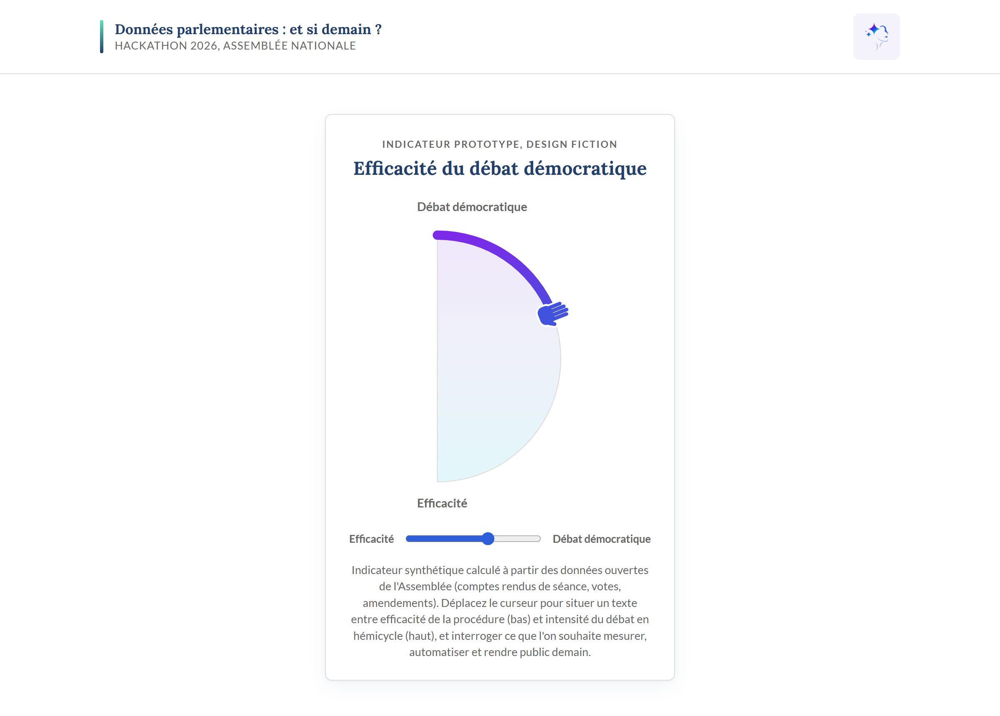

### Nom du défi
Données parlementaires : et si demain ?

### Description courte
Un atelier de design fiction qui imagine les futurs des données ouvertes du Parlement pour mieux comprendre les besoins, opportunités et risques d'aujourd'hui, illustré par un prototype d'indicateur d'efficacité du débat démocratique.

### Porteur
Sumi Saint-Auguste et Fabien Lechevalier

### Description longue
Atelier de design fiction explorant les futurs possibles des données ouvertes de l'Assemblée nationale, afin de mieux comprendre les besoins, opportunités et risques du présent.

À partir de scénarios spéculatifs (« et si demain... »), nous questionnons les usages souhaitables de la donnée parlementaire pour éclairer les choix d'aujourd'hui :

- une IA qui génère des propositions de loi à partir des auditions ;
- des groupes politiques équipés d'un moteur d'amendements entraîné sur les jeux de données parlementaires ;
- une participation citoyenne continue au processus législatif ;
- des marchés prédictifs estimant la probabilité d'adoption d'un texte.

Pour rendre ces futurs tangibles, nous prototypons **« Efficacité du débat démocratique »** : un indicateur synthétique, calculé à partir des données ouvertes de l'Assemblée (comptes rendus de séance, votes, amendements), qui donne à voir la qualité et l'intensité du débat en hémicycle. Il sert de support de discussion pour interroger ce que l'on souhaite (ou non) mesurer, automatiser et rendre public demain.

Le déroulé de l'atelier alterne temps de projection (écriture des scénarios), analyse des opportunités et des risques associés à chaque futur, et manipulation du prototype pour ancrer la réflexion dans des choix concrets de conception.

### Image principale

### Contributeurs
- Eren Atolgan
<!-- Ajoutez ici les autres contributeurs : - Prenom Nom -->

### Ressources utilisées
Cochez les ressources utilisées en remplaçant `[ ]` par `[x]`.

<!-- Pre-cochees : les jeux mobilises par l'indicateur de debat. Ajustez selon vos usages reels. -->

- [ ] `openfisca-france-parameters` — Base de données de paramètres ✺ OpenFisca
- [ ] `an-dossiers-legislatifs` — Dossiers législatifs de l'Assemblée nationale (législature courante) ✺ Assemblée nationale
- [x] `an-amendements-xvii` — Amendements déposés à l'Assemblée nationale (législature actuelle) ✺ Assemblée nationale
- [x] `an-comptes-rendus` — Comptes rendus de la séance publique à l'Assemblée nationale (législature actuelle) ✺ Assemblée nationale
- [x] `an-votes-xvii` — Votes des députés (législature actuelle) ✺ Assemblée nationale
- [ ] `an-deputes-en-exercice` — Députés en exercice ✺ Assemblée nationale
- [ ] `an-deputes-historique` — Historique des députés ✺ Assemblée nationale
- [ ] `an-deputes-senateurs-ministres-par-legislature` — Députés, sénateurs et ministres d'une législature ✺ Assemblée nationale
- [ ] `an-agenda-reunions` — Agenda des réunions à l'Assemblée nationale (législature courante) ✺ Assemblée nationale
- [ ] `an-questions-gouvernement` — Questions de l'Assemblée nationale au Gouvernement ✺ Assemblée nationale
- [ ] `an-questions-gouvernement-ecrites` — Questions écrites de l'Assemblée nationale au Gouvernement ✺ Assemblée nationale
- [ ] `an-questions-gouvernement-orales` — Questions orales de l'Assemblée nationale au Gouvernement ✺ Assemblée nationale
- [ ] `premier-ministre-legi` — Codes, lois et règlements consolidés ✺ Premier ministre
- [ ] `premier-ministre-dole` — Dossiers législatifs Légifrance ✺ Premier ministre
- [ ] `premier-ministre-jorf` — Édition ''Lois et décrets'' du Journal officiel ✺ Premier ministre
- [ ] `senat-dispositifs-textes` — Dispositifs des textes déposés ou adoptés au Sénat ✺ Sénat
- [ ] `senat-dossiers-legislatifs` — Dossiers législatifs du Sénat ✺ Sénat
- [ ] `senat-amendements` — Amendements déposés au Sénat ✺ Sénat
- [ ] `senat-senateurs` — Sénateurs ✺ Sénat
- [ ] `senat-questions-gouvernement` — Questions orales et écrites du Sénat au Gouvernement ✺ Sénat
- [ ] `senat-comptes-rendus` — Comptes rendus de la séance publique au Sénat ✺ Sénat
- [ ] `an-et-co-database-regroupement-toutes-donnees` — Base de données unifiée Parlement / Législation / Service Public ✺ Assemblée nationale & communauté
- [ ] `an-et-co-serveur-mcp-regroupement-toutes-donnees` — Serveur MCP  - Accès unifié Parlement / Législation / Service Public ✺ Assemblée nationale & communauté
- [ ] `an-et-co-api-regroupement-toutes-donnees` — API - Accès unifié Parlement / Législation / Service Public ✺ Assemblée nationale & communauté
- [ ] `legiwatch-api-parlement` — API Parlement ✺ LegiWatch
- [ ] `legiwatch-database-parlement` — Base de données Parlement ✺ LegiWatch
- [ ] `legiwatch-serveur-mcp-parlement` — Serveur MCP Parlement ✺ LegiWatch

### Galerie
- [Scénarios de design fiction](images/cover.png)
<!-- Ajoutez vos captures : - [Image 2](images/image-2.png) -->

### Documents
[Présentation](hackathon-an-2026/Et si, en 2035, nous plaçons l’IA au coeurde la fabrique de la loi et du débat démocratique .pdf)

### URL de démonstration
<!-- Renseignez l'URL de votre demo une fois deployee -->
https://votre-application.example.com

### Diapositives de présentation
<!-- Deposez votre PDF dans docs/ puis referencez-le ici -->
[Diapositives de présentation](docs/diapositives.pdf)
